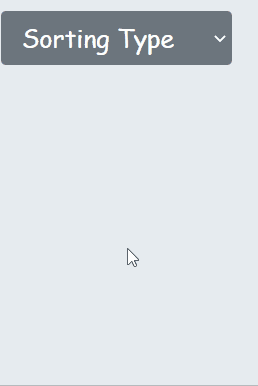
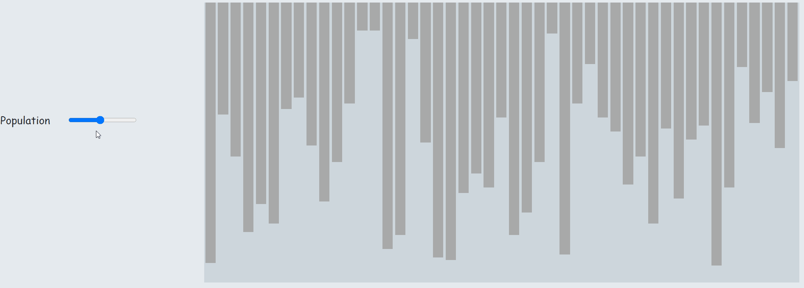
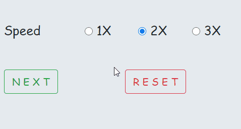
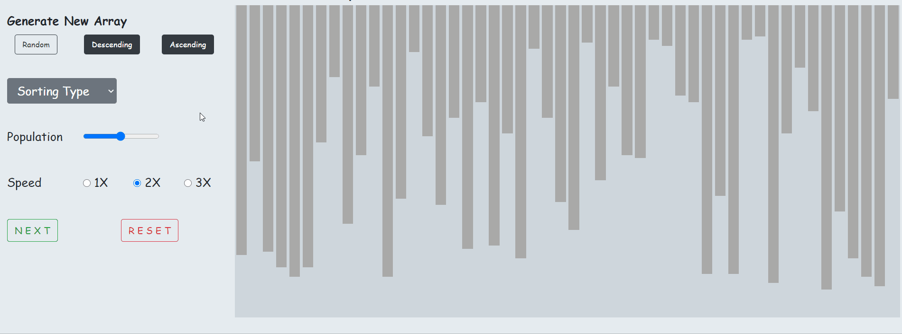

# Visualizer
This is my side project where I have created a web page to depict some of the mostly used Sorting Algorithms, using bars and colours.   This portal can be used for educational purpose, for explaining the Algorithms to freshers.   Visit the portal : <a href="https://kmrsaket.github.io/Visualizer/">Algorithm Visualizer</a>

## First thing First
Here, Bars are used to represent a number in the array and it's height is proportional to the value of the element. Also, different color codes are used to distinguish between different steps involved in the algorithm.
* Initial color	-  `#A9A9A9`
* Checking Elements (Primary color)	-  `#9955dd`
* Checking Elements (Secondary color)	-  `#99dd55`
* Need to Swap	-  `#ff000d`
* Comparing Elements	-  `#808080`
* Intermediate Sorted Elements	-  `#e5e500`
* Final Sorted Array	-  `#292F33`
* Pivot	-  `#000000`

## How to use
Keeping freshers in mind, this webpage is designed in such a way that it's very easy to use and every functionalities are self explanatory.
<ol>
<li>Generating new array.

</li>

 
<li>Select any Sorting Algorithm.

</li>

 
<li>Control the array size (population).

</li>

 
<li>Choose the speed for visual and click NEXT.

</li>

 
</ol>

## Demo

Thanks for giving you time. Do give a star to this repo if you liked my work. Also feel free to pull this repo and create you own version of visualizer.
